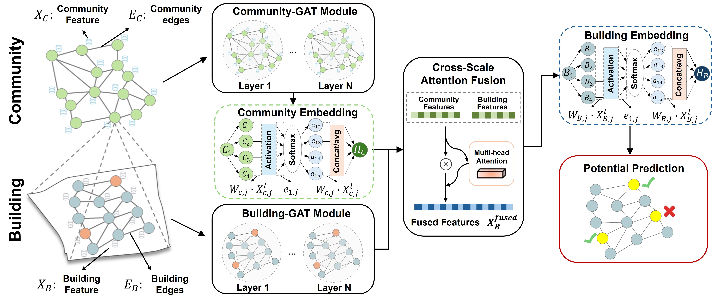

# URHGN: Urban Renewal Hierarchical Graph Network

[](https://www.python.org/downloads/)
[](https://pytorch.org/)
[](https://pytorch-geometric.readthedocs.io/)
[](LICENSE)

URHGN is a sophisticated **hierarchical graph convolutional neural network** designed for urban renewal potential prediction. The model leverages hierarchical spatial relationships between buildings and communities to provide accurate predictions and comprehensive explainability.

##  Architecture Overview



URHGN implements a novel **hierarchical architecture** that processes spatial information at multiple scales:

- **Community Layer**: Captures neighborhood-level spatial patterns using graph attention networks
- **Building Layer**: Processes individual building features with dynamic community context integration
- **Multi-Head Attention**: Adaptive feature fusion mechanism that learns optimal building-community interactions
- **Batch Processing**: Efficient graph construction and processing for large-scale urban data

##  Key Features

- **Hierarchical Modeling**: Building and community double-layer spatial processing
- **Multi-Head Attention**: Dynamic feature fusion for optimal context integration
- **Spy Sampling**: Advanced negative example selection using ensemble methods
- **Comprehensive Evaluation**: ROC, PR curves, calibration analysis, and confusion matrices
- **GNNExplainer**: Built-in interpretability for feature importance analysis

##  Project Structure

```
URHGN/
├── README.md                    # Project documentation
├── requirements.txt             # Python dependencies
├── .gitignore                   # Git ignore file
├── LICENSE                      # MIT License
├── setup.py                     # Installation script
│
├── models/                      # Model implementations
│   └── urhgn.py                 # Core URHGN model
│
├── baseline_model/                 # Baseline model comparison
│   ├── graph_neural_networks.py    # Single-layer GCN and GAT models (English)
│   └── traditional_ml_models.py    # Traditional ML models (English)
│
├── data/                       # Data directories
│   ├── shp/                    # geospatial data
│   └── csc/                    # csv data for convenience
│
├── models/                      # Trained models
│
├── results/                     # Output results
│   └── (scripts automatically create subdirectories)
│
└── Core Python scripts:
    ├── train.py                # Training script 
    ├── spy_sample.py           # Negative sampling strategy 
    ├── explain.py              # GNNExplainer analysis 
    ├── counterfactual.py       # Counterfactual analysis 
    └── Predict.py              # Prediction script
```

##  Start

### 1. Installation

```bash
# Clone the repository
git clone https://github.com/your-username/URHGN.git
cd URHGN

# Install dependencies
pip install -r requirements.txt

# Install PyTorch Geometric (additional step)
pip install torch-geometric -f https://data.pyg.org/whl/torch-1.12.0+cu113.html
```

### 2. Data Preparation

URHGN expects geospatial data in Shapefile format:

**Building Data** (`buildings.shp`):
- Building geometries (polygons)
- Building features: `area`, `perimeter`, `height`, `floor`
- Building function: one-hot encoded `function_*` columns
- Roof types: one-hot encoded `roof_*` columns
- Remote sensing features: `hsr_*` columns
- Target variable: `renewal` (1=positive, 2=negative, negative sample from spy sampling)

**Community Data** (`community.shp`):
- Community boundaries (polygons)
- POI features: `POI_1` to `POI_16`
- Demographics: `population`, `green_ratio`, `price`

### 3. Usage Workflow

#### Step 1: Prepare Data
Place your shapefile data in the `data/shp/` directory:
```bash
# Example data structure
data/shp/
├── buildings.shp
├── buildings.shx
├── buildings.dbf
├── community.shp
├── community.shx
└── community.dbf
```

#### Step 2: Apply Spy Sampling (Optional but Recommended)
```bash
python spy_sample.py
```
- Generate high-quality negative samples
- Output: `data/buildings_with_reliable_negative.shp`

#### Step 3: Train Model
```bash
python train.py
```
- Automatically detects best GPU
- 5-fold cross-validation
- Generates evaluation plots
- Output: `results/` directory

#### Step 4: Model Explainability
```bash
python explain.py
```
- GNNExplainer feature importance analysis
- Output: `explanations/` directory

#### Step 5: Counterfactual Analysis
```bash
python counterfactual.py
```
- Component contribution analysis
- Output: `counterfactual_results/` directory

##  Model Architecture

### URHGN Model Architecture

The core **URHGN model** implements a sophisticated double-layer processing pipeline:

1. **Community Layer Processing**:
   ```python
   community_features → GATv2Conv(64, heads=8) → ReLU → Dropout →
   GATv2Conv(32, heads=4) → community_embeddings
   ```

2. **Multi-Head Attention Fusion**:
   ```python
   building_features + community_embeddings → MultiHeadAttention(8 heads) → weighted_features
   ```

3. **Building Layer Processing**:
   ```python
   weighted_features → GATv2Conv(64, heads=8) → ReLU → Dropout →
   GATv2Conv(32, heads=4) → ReLU → Dropout →
   GATv2Conv(2, heads=1) → predictions
   ```

### Key Components

#### Multi-Head Feature Attention
- **8 attention heads** for diverse feature interactions
- **Dynamic weighting** based on spatial context
- **Layer normalization** for stable training

#### Graph Construction
- **Community graphs**: Spatial contiguity-based adjacency
- **Building graphs**: k-nearest neighbors (k=5) within communities
- **Batch processing**: Efficient handling of large urban datasets

#### Spy Sampling Strategy
- **Ensemble classifiers**: Random Forest, SVM, Logistic Regression, KNN, MLP
- **Uncertainty quantification**: Entropy-based sample selection
- **Density-aware selection**: Representative negative examples

##  Evaluation Metrics

URHGN provides comprehensive evaluation capabilities:

### Classification Metrics
- **Accuracy**: Overall prediction accuracy
- **Precision**: Positive predictive value
- **Recall**: Sensitivity (True Positive Rate)
- **F1-Score**: Harmonic mean of precision and recall
- **AUC-ROC**: Area under ROC curve
- **AUC-PR**: Area under Precision-Recall curve

### Visualization Tools
- **Training curves**: Loss and accuracy progression
- **ROC/PR curves**: Performance across thresholds
- **Calibration curves**: Prediction probability calibration
- **Confusion matrices**: Classification error analysis
- **Feature importance**: Explainability visualizations

##  Explainability

### GNNExplainer Integration

URHGN includes built-in support for **GNNExplainer** to provide:

- **Feature importance**: Ranking of building and community features
- **Neighborhood analysis**: Important spatial relationships
- **Global explanations**: Model-wide interpretability
- **Local explanations**: Individual prediction rationales

### Counterfactual Analysis

Comprehensive **counterfactual experiments** assess component contributions:

- **Full**: Complete model (baseline)
- **No_Edges**: Remove all edges (attributes only)
- **No_Attrs**: Remove all attributes (edges only)

### Interpretability Outputs

The analysis generates detailed reports including:
- **Feature importance rankings** with statistical significance
- **Spatial importance maps** showing critical neighborhoods
- **Component contribution analysis** quantifying architectural decisions
- **Prediction flip analysis** identifying decision boundaries

##  Performance Benchmarks

URHGN has been extensively evaluated on urban renewal datasets:

### Classification Performance
| Metric | Value |
|--------|-------|
| Accuracy | 0.857±0.009 |
| Precision | 0.806±0.017 |
| Recall | 0.910±0.020 |
| F1-Score | 0.855±0.012 |
| ROC-AUC | 0.928±0.010 |
| PR-AUC | 0.890±0.021 |

### Comparison with Baselines
| Model | Precision | Recall | Accuracy | F1-score | ROC-AUC | PR-AUC |
|-------|---------|----------|---------------|-------|---------|----------|
| **URHGN (Ours)** | 0.806±0.017 | 0.910±0.020 | 0.857±0.009 | 0.855±0.012 | 0.928±0.010 | 0.890±0.021 |
| GCN | 0.731±0.035 | 0.858±0.034 | 0.786±0.025 | 0.789±0.020 | 0.868±0.019 | 0.829±0.020 |
| GAT | 0.745±0.008 | 0.888±0.032 | 0.807±0.007 | 0.810±0.013 | 0.891±0.009 | 0.857±0.021 |
| RF | 0.709±0.007 | 0.844±0.017 | 0.766±0.009 | 0.771±0.004 | 0.826±0.005 | 0.744±0.022 |
| XGBoost | 0.705±0.006 | 0.806±0.026 | 0.753±0.014 | 0.752±0.005 | 0.818±0.011 | 0.731±0.033 |
| MLP | 0.690±0.017 | 0.883±0.010 | 0.761±0.008 | 0.775±0.009 | 0.820±0.009 | 0.732±0.029 |
| KNN | 0.687±0.017 | 0.713±0.017 | 0.715±0.009 | 0.700±0.011 | 0.778±0.010 | 0.684±0.015 |
| SVM | 0.701±0.009 | 0.840±0.014 | 0.759±0.010 | 0.764±0.004 | 0.815±0.008 | 0.717±0.018 |
| LR | 0.671±0.021 | 0.739±0.024 | 0.710±0.014 | 0.703±0.019 | 0.767±0.011 | 0.663±0.033 |

##  Advanced Usage

### Custom Model Configuration
```python
from models.urhgn import URHGNModel

# Create custom URHGN model
model = URHGNModel(
    num_building_features=None,    # Custom number of building features
    num_community_features=None,   # Custom number of community features
    device='cuda:0'             # Specify GPU
)
```

### Custom Training Parameters
```python
# Modify these parameters in train.py:
device_id = 0           # Specific GPU ID (None for auto-selection)
k_folds = 5            # Cross-validation folds
num_epochs = 200       # Maximum training epochs
k_neighbors = 5        # k-nearest neighbors for building graphs
```

### Batch Inference
```python
# Load trained model
model = URHGNModel(num_building_features=None, num_community_features=None)
checkpoint = torch.load('results/best_model.pth')
model.load_state_dict(checkpoint['model_state_dict'])

# Model automatically handles batch processing of building graphs
```

##  Baseline Models

The `baseline_model/` directory provides comprehensive comparison models for urban renewal prediction. These baseline implementations help validate the effectiveness of the URHGN hierarchical approach.

### Running Baseline Comparisons

For a comprehensive comparison study:

```bash
# 1. Run traditional ML baselines
python baseline_model/traditional_ml_models.py

# 2. Run graph neural network baselines
python baseline_model/graph_neural_networks.py

# 3. Run URHGN model
python train.py

# 4. Compare results in the respective output directories
```

All baseline models generate:
- **Performance summaries** (CSV format)
- **ROC and PR curves** (PNG format)
- **Detailed metrics** with confidence intervals
- **Training logs** for reproducibility

##  License

This project is licensed under the MIT License - see the [LICENSE](LICENSE) file for details.

##  Acknowledgments

- **PyTorch Geometric** team for the excellent GNN library
- **Geopandas** for geospatial data processing
- **Scikit-learn** for machine learning utilities
- Urban planning datasets and contributions from various municipalities

##  Support

- **Email**: yanxiaoqin@stu.pku.edu.cn

##  Data Availability

- This code contains publicly available data for parts of Beijing. For collaboration regarding the complete dataset, please contact us.
---

**URHGN** - Advancing urban renewal prediction through hierarchical graph neural networks.
